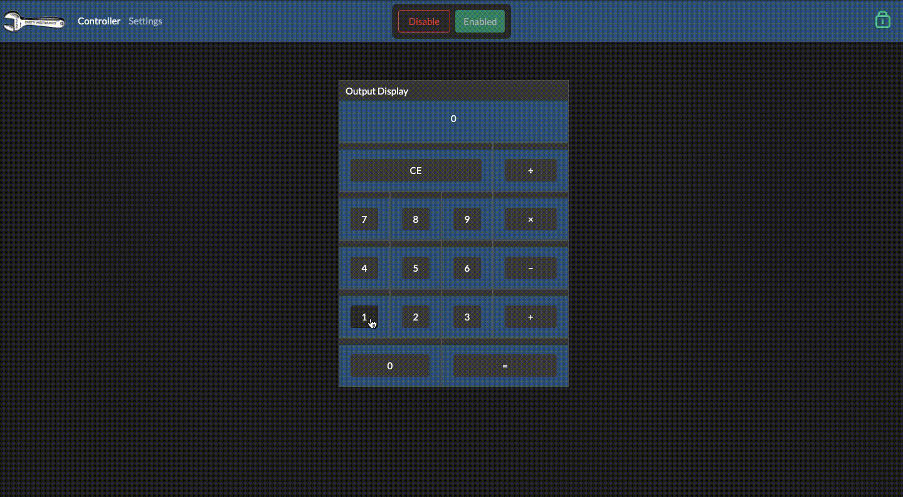

# A Simple Calculator Demo
## Demonstration program for an example of virtualizing hardware interfaces with widgets

## How to try the demo
1. Upload using the `calculatorDemoProgram.ino` sketch
2. Open the driver station in your browser
3. Go to `Settings > Widget Configuration Settings > Profile` and upload the `calculatorDemoWidgetConfig.txt` profile
4. Under `Controller Input Settings` set the controller input mode to `GamePad`. This way there will be no gamePad widget by default unless you plug one in
5. Enable your dashboard
 

#### Happy Calculating!